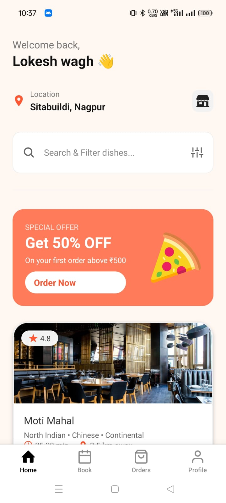

# 🟧 VarnueAi Mobile App  
### Built with Expo, React Native & TypeScript

The **VarnueAi Mobile Application** is a fully functional, modern, and scalable mobile app developed for the Restarant and Order and Bock a Food.  
This project is built using **Expo**, **React Native**, and **TypeScript**, featuring a clean UI, smooth navigation, and a structured architecture using **Expo Router**.

---

## 🚀 Tech Stack Used

- **Expo (React Native)**
- **TypeScript**
- **Expo Router — File-Based Navigation**
- **AsyncStorage State Persistence**
- **Beautiful UI with Gradients & Responsive Layouts**
- **Modular & Reusable Components**
- **Optimized Layouts for iOS & Android**
- **Supabase For Store User and order Data**

---

## 📦 Installation Guide

## Get started

1. Clone the Project
   ```bash
   git clone git@github.com:LokeshWagh/VarnueAiMobileApp.git
   ```
2. Go to Folder
   ```bash
   cd VarnueAiMobileApp
   ```
3. Install dependencies

   ```bash
   npm install
   ```

4. Start the app

   ```bash
    npm run web
   ```
## How To Run In Mobile 
 - Download Expo (Android app)
 - Run the project By npm run web
 - scan the QR show In Terminal in Expo Add

## OverView Of projects 
### 1. Home page Structure 



